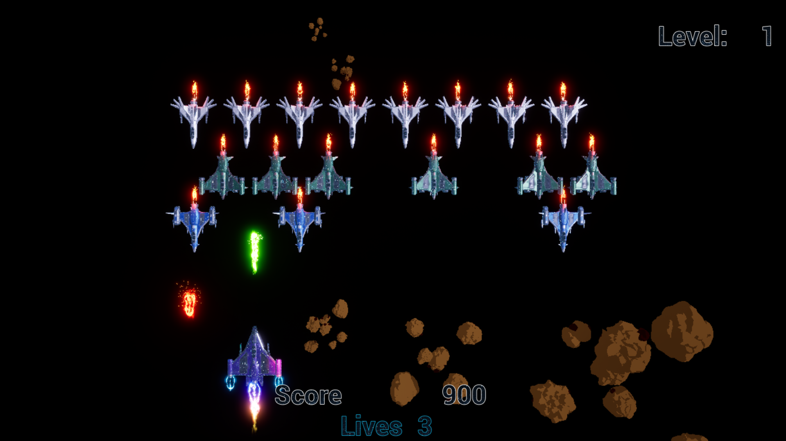
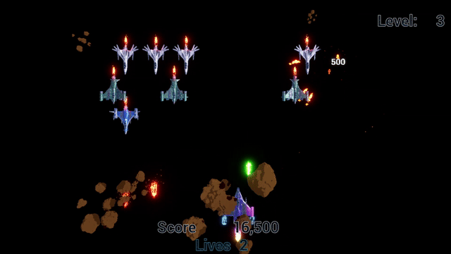

# Space Invaders UE5

**Space Invaders** is a simple *Space Invaders–style* game created in **Unreal Engine 5**, focused on demonstrating the use of **shaders and real-time graphic effects**.

---

## 📌 Project Overview

The project recreates basic Space Invaders gameplay mechanics while emphasizing visual effects implemented through custom shaders.  
It serves as a technical demo showing how different shader techniques can be applied to specific game elements.

---

## 🎮 Gameplay

- Classic Space Invaders–inspired mechanics
- Player-controlled ship vs. incoming enemies
- Simple but readable arcade-style gameplay

---

## 🎨 Shaders & Graphic Effects

- **Chromatic Aberration**  
  Used as a post-process effect to visually represent **damage taken by the player**.

- **Cel Shading**  
  Applied **only to meteorites**, giving them a stylized, cartoon-like appearance and clearly distinguishing them from other objects.

- **Cube Map  - Environment Mapping**  
  Used **exclusively for ships** to simulate reflective surfaces and enhance visual depth.

---

## 🛠️ Technologies Used

- **Unreal Engine 5**
- Custom shaders - Material Editor & HLSL concepts
- Post-process effects

---

## 🧠 What I Learned

- Creating and applying **different shader effects** for specific game elements
- Using shaders as **gameplay feedback**
- Working with **cube maps** and environment reflections
- Designing effects that affect **only selected objects**

---

### Gameplay

### Damage Feedback

> *The GIF above shows the chromatic aberration effect triggered when the player takes damage.*
---

*All graphical assets used in the project come from FAB.*
*This project was created as a **student project** covering shader programming from a graphics programming course.*
